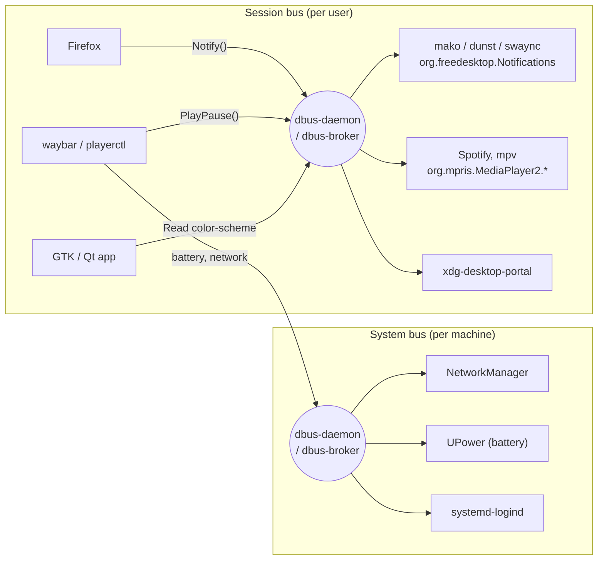

# freedesktop.org, XDG and D-Bus

Why a GTK app, a Qt app and a random Rust TUI can all find the same icon theme, open
the same default browser, and send notifications to the same daemon. The answer is a
set of shared conventions, mostly written and hosted by freedesktop.org.

## TL;DR

| Topic                     | What it is                                                                               |
| ------------------------- | ---------------------------------------------------------------------------------------- |
| freedesktop.org           | Neutral project that hosts specs and shared code for Linux / Unix desktops               |
| XDG                       | "X Desktop Group", the original name of freedesktop.org, still the prefix of most specs  |
| Specs                     | Text documents: where to put config, how to describe an app, how to look up an icon...   |
| Shared projects           | Real code: Mesa, Wayland, Xorg, D-Bus, PipeWire, fontconfig, libinput, polkit...         |
| D-Bus                     | Message bus for inter-process communication, the "nervous system" of the desktop         |
| Why it matters for ricing | Follow the specs and every component, from any toolkit, picks up your theme and settings |

## What is freedesktop.org

- Started in 2000 by Havoc Pennington (Red Hat) as the **X Desktop Group** (XDG).
- Goal: stop GNOME, KDE and the others from each reinventing the same basic things in
  incompatible ways.
- It is **not** a formal standards body. Specs are "recommendations": a spec wins
  because enough desktops implement it.
- It plays two roles:
  1. **Spec host**: short, pragmatic documents at
     [specifications.freedesktop.org](https://specifications.freedesktop.org/).
  2. **Code host**: a GitLab instance ([gitlab.freedesktop.org](https://gitlab.freedesktop.org/))
     for low-level projects shared by every desktop.

Some projects hosted there that you use every day, even without knowing it:

| Project              | Role                                                                         |
| -------------------- | ---------------------------------------------------------------------------- |
| Mesa                 | Open source OpenGL / Vulkan drivers                                          |
| Wayland, Xorg        | Display protocols and servers (see [x11-vs-wayland.md](./x11-vs-wayland.md)) |
| libinput             | Keyboard, mouse, touchpad input handling                                     |
| D-Bus                | Inter-process message bus (detailed below)                                   |
| PipeWire, PulseAudio | Audio and video streams                                                      |
| fontconfig           | Font discovery and configuration                                             |
| polkit               | Privilege authorization ("enter your password to do X")                      |
| NetworkManager       | Network configuration                                                        |
| shared-mime-info     | Database of file types                                                       |
| xdg-utils            | `xdg-open`, `xdg-mime`, `xdg-settings`...                                    |

## The XDG conventions

The important idea: each spec defines a **file format** and a **lookup path**. Any
program, in any language, with any toolkit, can read the same files in the same places.

### XDG Base Directory: where files go

This is the reason your dotfiles live in `~/.config` and not in 40 hidden folders in `$HOME`.

| Variable          | Default                       | Content                                                                         |
| ----------------- | ----------------------------- | ------------------------------------------------------------------------------- |
| `XDG_CONFIG_HOME` | `~/.config`                   | User configuration (the dotfiles)                                               |
| `XDG_DATA_HOME`   | `~/.local/share`              | User data: themes, icons, fonts, `.desktop` files                               |
| `XDG_STATE_HOME`  | `~/.local/state`              | State to keep between runs, but not config (history, logs)                      |
| `XDG_CACHE_HOME`  | `~/.cache`                    | Can be deleted at any time                                                      |
| `XDG_RUNTIME_DIR` | `/run/user/$UID`              | Sockets, pipes, lives only for the session (Wayland and D-Bus sockets are here) |
| `XDG_CONFIG_DIRS` | `/etc/xdg`                    | System-wide config, lower priority                                              |
| `XDG_DATA_DIRS`   | `/usr/local/share:/usr/share` | System-wide data, lower priority                                                |

Lookup rule: user dir first, then system dirs in order. First match wins (or files are
merged, depending on the spec).

```sh
~/.config/nvim/init.lua
~/.config/sway/config
~/.config/gtk-3.0/settings.ini
~/.local/share/themes/catppuccin-mocha/
~/.local/share/icons/Papirus-Dark/
```

Companion tool: `xdg-user-dirs` defines `~/Documents`, `~/Downloads`, `~/Pictures`...
in `~/.config/user-dirs.dirs`, so they can be renamed or translated.

### Desktop Entry: describing an application

A `.desktop` file is how launchers, menus, file managers and docks know that an app
exists. Rofi, wofi, fuzzel, GNOME Shell, KDE: they all read the same files.

Lookup: `$XDG_DATA_HOME/applications` then `$XDG_DATA_DIRS/applications`.

```ini
# ~/.local/share/applications/nvim-kitty.desktop
[Desktop Entry]
Type=Application
Name=Neovim (kitty)
Comment=Edit text files
Exec=kitty -e nvim %F
Icon=nvim
Terminal=false
Categories=Utility;TextEditor;
MimeType=text/plain;text/markdown;
```

The same format is reused by the **Autostart** spec: put a `.desktop` file in
`~/.config/autostart/` and the session starts it at login.

### MIME types and default applications

- **shared-mime-info**: the database that says "`.md` is `text/markdown`".
- **mimeapps.list** (`~/.config/mimeapps.list`): which app opens which type.

```ini
[Default Applications]
text/markdown=nvim-kitty.desktop
x-scheme-handler/https=firefox.desktop
inode/directory=thunar.desktop
```

`xdg-open file.md` reads this, and so do browsers and file managers.

```sh
xdg-mime query default text/markdown
xdg-mime default nvim-kitty.desktop text/markdown
```

### Icon Theme and Cursor themes

- An icon theme is a folder with an `index.theme` file and icons sorted by size and context.
- Lookup: `~/.local/share/icons`, `~/.icons`, then `$XDG_DATA_DIRS/icons`.
- `Inherits=` in `index.theme` gives a fallback chain. The final fallback is always `hicolor`.
- Apps ask for a **name** (`nvim`, `folder`, `battery-low`), never a path. Change the
  theme, every app follows.
- Cursor themes use the same folders (a theme with a `cursors/` subfolder).

```ini
# ~/.local/share/icons/MyTheme/index.theme
[Icon Theme]
Name=MyTheme
Inherits=Papirus-Dark,hicolor
Directories=scalable/apps
```

This is exactly what a ricer uses: drop a Catppuccin icon or cursor theme in
`~/.local/share/icons`, select it once, done for GTK and Qt apps.

### Other specs worth knowing

| Spec                  | What it standardizes                                                          |
| --------------------- | ----------------------------------------------------------------------------- |
| Desktop Notifications | How to send a popup notification (a D-Bus API, see below)                     |
| Menu                  | How the application menu is organized into categories                         |
| Trash                 | Common trash folder (`~/.local/share/Trash`) for every file manager           |
| Thumbnail Managing    | Shared thumbnail cache (`~/.cache/thumbnails`)                                |
| Recent files          | Shared "recently used" list                                                   |
| Sound Theme           | Named event sounds, same idea as icon themes                                  |
| EWMH (wm-spec)        | X11 only: how apps and window managers talk (fullscreen, workspaces, taskbar) |
| System Tray (XEmbed)  | X11 tray icons, today replaced by StatusNotifierItem over D-Bus               |
| MPRIS                 | D-Bus API to control media players (play, pause, next)                        |
| Secret Service        | D-Bus API for password storage (gnome-keyring, KWallet, KeePassXC)            |

### XDG Desktop Portals

A more recent convention, very important with Wayland and Flatpak. A **portal** is a
D-Bus service (`org.freedesktop.portal.*`) that apps use to ask for things they cannot
or should not do directly:

- open a file chooser,
- share the screen (screencast under Wayland),
- take a screenshot,
- open a URL,
- read global settings, such as **dark or light mode** (`org.freedesktop.appearance color-scheme`).

`xdg-desktop-portal` is the front service, and each desktop provides a backend:
`xdg-desktop-portal-gtk`, `-gnome`, `-kde`, `-wlr` (Sway), `-hyprland`...

## What is D-Bus

D-Bus is an **IPC (inter-process communication) message bus**. It lets processes call
methods on each other and broadcast events, without knowing each other in advance.

- Created around 2002 at freedesktop.org, 1.0 in 2006.
- Replaced KDE's DCOP and GNOME's CORBA / Bonobo: one common bus for every desktop.
- Reference daemon: `dbus-daemon`. A faster reimplementation: `dbus-broker` (default on
  Fedora and Arch).

### Two buses

| Bus             | Scope                          | Examples                                                         |
| --------------- | ------------------------------ | ---------------------------------------------------------------- |
| **System bus**  | One per machine, root services | systemd, logind, NetworkManager, UPower, BlueZ, udisks           |
| **Session bus** | One per logged-in user session | notifications, media players, portals, keyring, desktop settings |

The session bus socket lives in `$XDG_RUNTIME_DIR/bus`, and apps find it through
`DBUS_SESSION_BUS_ADDRESS`.



### Vocabulary

A D-Bus call looks like an object-oriented method call across processes.

| Concept     | Example                          | Meaning                                                                                 |
| ----------- | -------------------------------- | --------------------------------------------------------------------------------------- |
| Bus name    | `org.freedesktop.Notifications`  | "Address" of a service on the bus. Each connection also gets a unique name like `:1.42` |
| Object path | `/org/freedesktop/Notifications` | An object exposed by the service                                                        |
| Interface   | `org.freedesktop.Notifications`  | A named set of methods, signals and properties                                          |
| Method      | `Notify(...)`                    | Call with arguments, get a reply                                                        |
| Signal      | `NotificationClosed(id, reason)` | Broadcast event, anyone can listen                                                      |
| Property    | `PlaybackStatus`                 | Value you can get / set, with a change signal                                           |

Two more features that make the desktop work:

- **Activation**: a service does not need to run in advance. If a call targets
  `org.freedesktop.Notifications` and nobody owns that name, the bus starts the program
  listed in `/usr/share/dbus-1/services/*.service`.
- **Security**: the system bus has policies, and sensitive actions go through polkit.

### Why it matters: the spec is the interface, the implementation is swappable

The Desktop Notifications spec only says "own the name `org.freedesktop.Notifications`
and implement `Notify`". So any app, `notify-send` included, works with GNOME Shell,
KDE Plasma, `dunst`, `mako` or `swaync`. Swap one for another, restyle it in Catppuccin
colors, no app notices. Same for MPRIS: `playerctl` and a waybar module control Spotify,
mpv or Firefox the same way.

### Try it

```sh
# List services on the session bus
busctl --user list

# Send a notification, the high-level way
notify-send "Hello" "from the terminal"

# Same thing, as a raw D-Bus method call
gdbus call --session \
  --dest org.freedesktop.Notifications \
  --object-path /org/freedesktop/Notifications \
  --method org.freedesktop.Notifications.Notify \
  "demo" 0 "" "Hello" "from D-Bus" "[]" "{}" 5000

# Watch every notification going through the bus
dbus-monitor --session "interface='org.freedesktop.Notifications'"

# Ask the portal if the desktop prefers dark mode (0: none, 1: dark, 2: light)
gdbus call --session \
  --dest org.freedesktop.portal.Desktop \
  --object-path /org/freedesktop/portal/desktop \
  --method org.freedesktop.portal.Settings.ReadOne \
  org.freedesktop.appearance color-scheme

# Control any media player
playerctl play-pause

# System bus: battery info from UPower
busctl introspect org.freedesktop.UPower /org/freedesktop/UPower/devices/DisplayDevice
```

GUI explorers: D-Spy (GNOME, successor of D-Feet), QDBusViewer (Qt).

## Links

- [freedesktop.org](https://www.freedesktop.org/)
- [All specifications](https://specifications.freedesktop.org/)
- [XDG Base Directory spec](https://specifications.freedesktop.org/basedir-spec/latest/)
- [Desktop Entry spec](https://specifications.freedesktop.org/desktop-entry-spec/latest/)
- [Icon Theme spec](https://specifications.freedesktop.org/icon-theme-spec/latest/)
- [Desktop Notifications spec](https://specifications.freedesktop.org/notification-spec/latest/)
- [D-Bus](https://www.freedesktop.org/wiki/Software/dbus/)
- [XDG Desktop Portal documentation](https://flatpak.github.io/xdg-desktop-portal/)
- [MPRIS spec](https://specifications.freedesktop.org/mpris-spec/latest/)
