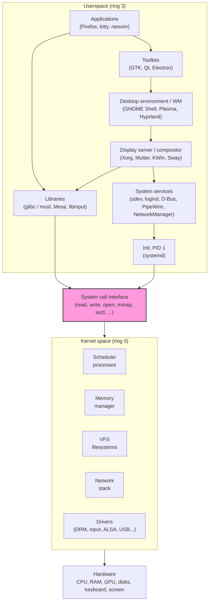
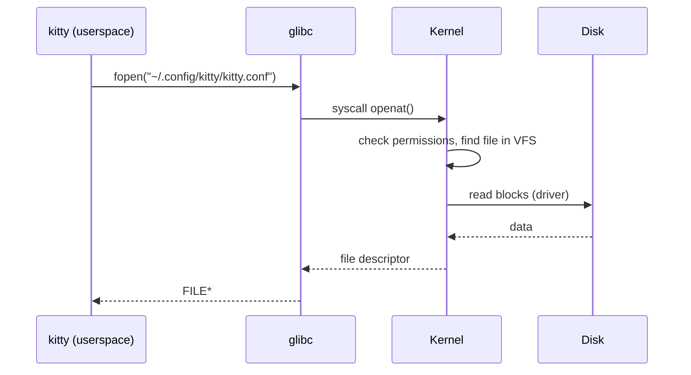
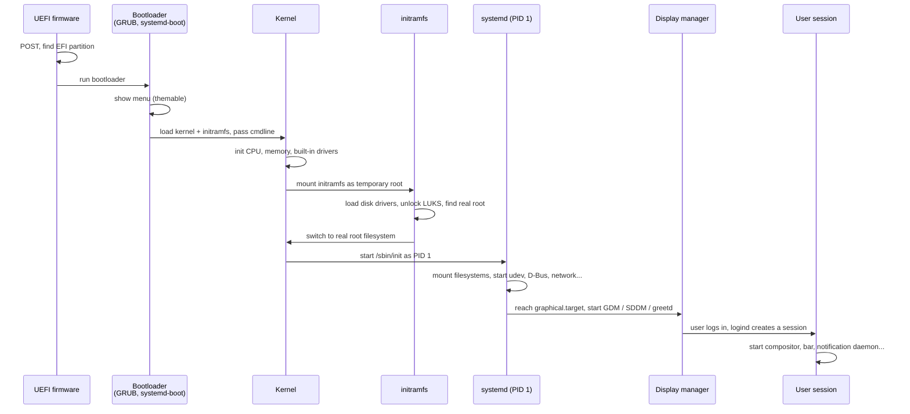
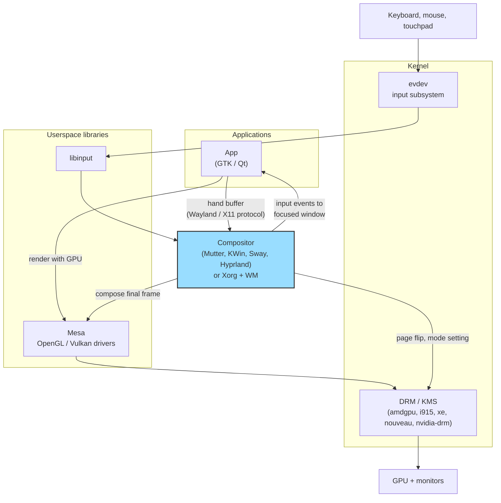
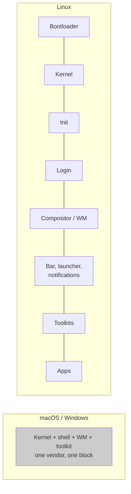

# Inside a Linux system: from kernel to desktop

What happens between the power button and the pixels of a themed status bar? A Linux
system is not one product. It is a stack of independent pieces, written by different
teams, glued together by stable interfaces. Each piece can be swapped. That is the whole
reason ricing is possible.

## TL;DR

| Layer                       | Role                                                         | Common examples                               |
| --------------------------- | ------------------------------------------------------------ | --------------------------------------------- |
| Hardware + firmware         | Starts the machine, finds a bootloader                       | UEFI, BIOS, Secure Boot                       |
| Bootloader                  | Loads the kernel and the initramfs into memory               | GRUB, systemd-boot, rEFInd, Limine            |
| Kernel                      | Owns the hardware, shares it between processes               | Linux (`6.x`)                                 |
| Init system (PID 1)         | Starts and supervises every other process                    | systemd, OpenRC, runit, s6                    |
| System services             | Devices, sessions, network, audio, IPC                       | udev, logind, D-Bus, NetworkManager, PipeWire |
| Display manager             | Graphical (or text) login screen                             | GDM, SDDM, LightDM, greetd, ly                |
| Display server / compositor | Puts windows on screen, routes input                         | Xorg, Mutter, KWin, Sway, Hyprland            |
| Desktop environment / WM    | Window layout, panels, launchers, settings                   | GNOME, KDE Plasma, XFCE, i3, Sway, Hyprland   |
| Toolkits                    | Draw buttons, menus, text inside apps                        | GTK, Qt, libadwaita, Electron, terminal UI    |
| Applications                | What you actually use                                        | Firefox, neovim, kitty, Thunar                |
| Distribution                | A curated selection of all the above, plus a package manager | Debian, Fedora, Arch, NixOS                   |

## The big picture



The one hard line in this picture is the **system call interface**. Everything above it is
ordinary programs. Everything below it is the kernel.

## Kernel vs userspace

### "Linux" is only the kernel

Strictly speaking, Linux is the kernel started by Linus Torvalds in 1991. The shell, the
core utilities (`ls`, `cp`, `grep`), the C library and the compiler mostly come from the
GNU project (started in 1983). This is why some people say "GNU/Linux". A full system adds
hundreds of other projects on top: systemd, Mesa, Wayland, GNOME, KDE...

On macOS or Windows, the kernel, the graphical shell, the window manager and the toolkit
ship together, from one vendor, and are not designed to be replaced. On Linux, each one is
a separate project.

### Two privilege levels

The CPU runs code at different privilege levels ("rings" on x86):

|                 | Kernel space                                 | Userspace                                     |
| --------------- | -------------------------------------------- | --------------------------------------------- |
| CPU mode        | Ring 0, privileged                           | Ring 3, restricted                            |
| Hardware access | Direct: I/O ports, device memory, interrupts | None, must ask the kernel                     |
| Memory          | Sees all physical memory                     | Sees only its own virtual address space       |
| Crash impact    | Kernel panic, whole machine down             | Only that process dies                        |
| Who runs there  | Linux + loaded modules (drivers)             | Every other program, including root processes |

Even `root` is a userspace process. Root has more _permissions_, but it still goes through
the same system calls as any other program.

### What the kernel does

- **Processes and scheduling**: decide which program runs on which CPU core, and for how long.
- **Memory**: give each process its own virtual memory, swap, share libraries between processes.
- **Filesystems (VFS)**: one tree (`/`) on top of ext4, btrfs, NTFS, network shares, RAM...
- **Drivers**: talk to the GPU, disks, USB, Wi-Fi, keyboard, sound card.
- **Networking**: TCP/IP, sockets, firewall (netfilter / nftables).
- **Security and isolation**: users, permissions, namespaces and cgroups (the base of containers).

Linux is a **monolithic** kernel: all of this runs in the same privileged space. But it is
**modular**: most drivers are loadable modules (`.ko` files) loaded on demand (`lsmod`,
`modprobe`).

### How userspace talks to the kernel



The interfaces the kernel exposes to userspace:

| Interface        | What it is                                                | Example                                                |
| ---------------- | --------------------------------------------------------- | ------------------------------------------------------ |
| System calls     | A few hundred functions, the only way to enter the kernel | `read`, `write`, `openat`, `mmap`, `clone`             |
| `/dev`           | Device files                                              | `/dev/dri/card0` (GPU), `/dev/input/event3` (keyboard) |
| `/proc`          | Info about processes and the kernel, as files             | `/proc/cpuinfo`, `/proc/1/cmdline`                     |
| `/sys`           | The device tree and driver settings, as files             | `/sys/class/backlight/*/brightness`                    |
| `ioctl`          | Device-specific commands on a `/dev` file                 | Mode setting on a GPU                                  |
| Netlink, sockets | Event and message channels                                | udev device events                                     |

"Everything is a file" is not only a slogan: you can change your screen brightness with
`echo 500 > /sys/class/backlight/intel_backlight/brightness`.

The golden rule of kernel development is **"we do not break userspace"**. The system call
interface stays stable across versions. That stability is what lets thousands of
independent userspace projects evolve at their own pace.

## Boot sequence



Steps worth knowing:

- **initramfs**: a small compressed filesystem loaded in RAM. It contains just enough
  tools and drivers to find and mount the real root disk (useful for encrypted disks, RAID,
  LVM). The splash screen (Plymouth) usually starts here.
- **PID 1**: the first userspace process. If it dies, the kernel panics. On most distros
  it is systemd, which starts services in parallel from unit files.
- **Targets**: systemd groups services in targets. `multi-user.target` is a text system,
  `graphical.target` adds the display manager.
- **Kernel command line**: options passed by the bootloader (`cat /proc/cmdline`), for
  example `quiet splash` to hide boot messages behind Plymouth.

## System services: the plumbing

Between the kernel and the desktop, a set of daemons does the "boring" work. You rarely
see them, but every desktop depends on them.

| Service                                     | Job                                                                                                                    |
| ------------------------------------------- | ---------------------------------------------------------------------------------------------------------------------- |
| **systemd**                                 | PID 1, starts and supervises services, also manages user services (`systemctl --user`)                                 |
| **udev** (systemd-udevd)                    | Receives device events from the kernel, creates `/dev` nodes, applies rules                                            |
| **logind** (systemd-logind)                 | Tracks users, seats and sessions, gives the active session access to GPU and input devices, handles lid / power button |
| **D-Bus**                                   | Message bus between processes (see [freedesktop.md](./freedesktop.md))                                                 |
| **polkit**                                  | Decides if an unprivileged process can do a privileged action ("enter your password")                                  |
| **NetworkManager** / iwd / systemd-networkd | Network and Wi-Fi configuration                                                                                        |
| **PipeWire** + WirePlumber                  | Audio and video streams, replaces PulseAudio and JACK, also used for screen sharing                                    |
| **UPower**, **bluez**                       | Battery info, Bluetooth                                                                                                |

A key point for graphics: thanks to **logind**, the compositor does not need to run as
root. logind hands it the file descriptors for `/dev/dri/card0` and `/dev/input/*` while
its session is active, and takes them back when you switch user or VT.

## The graphics stack

This is where the talk's topic starts: how pixels reach the screen and how key presses
reach an app.



| Piece                              | Where     | Role                                                                                     |
| ---------------------------------- | --------- | ---------------------------------------------------------------------------------------- |
| **DRM** (Direct Rendering Manager) | Kernel    | Manages GPU memory and command submission                                                |
| **KMS** (Kernel Mode Setting)      | Kernel    | Sets resolution and refresh rate, flips frames to the screen                             |
| **Mesa**                           | Userspace | Open source implementation of OpenGL and Vulkan (NVIDIA ships its own closed equivalent) |
| **evdev**                          | Kernel    | Exposes raw input events in `/dev/input/event*`                                          |
| **libinput**                       | Userspace | Turns raw events into gestures, acceleration, tap-to-click                               |
| **Display server / compositor**    | Userspace | Owns the screen, composes windows, routes input to the right app                         |

The difference between X11 and Wayland lives in the "compositor" box. See
[x11-vs-wayland.md](./x11-vs-wayland.md) for the details.

## Desktop environment, window manager, compositor

These words are often mixed up. They describe different scopes.

| Term                         | What it is                                                                                                                      | Examples                                  |
| ---------------------------- | ------------------------------------------------------------------------------------------------------------------------------- | ----------------------------------------- |
| **Window manager (WM)**      | Decides where windows go, their size, borders, focus                                                                            | i3, bspwm, Openbox, dwm (X11)             |
| **Compositor**               | Draws the final image from all windows (effects, transparency, vsync). On Wayland it is also the display server and the WM      | picom (X11), Sway, Hyprland, niri, river  |
| **Desktop environment (DE)** | A full integrated bundle: WM/compositor + panel + launcher + settings app + file manager + apps + a toolkit + a design language | GNOME, KDE Plasma, XFCE, Cinnamon, COSMIC |

What a DE bundles, for example:

| Component               | GNOME                     | KDE Plasma      | "DIY" tiling setup         |
| ----------------------- | ------------------------- | --------------- | -------------------------- |
| Compositor / WM         | Mutter                    | KWin            | Sway, Hyprland, i3 + picom |
| Shell (panel, overview) | GNOME Shell               | Plasma Shell    | waybar, polybar, eww       |
| Launcher                | GNOME Shell overview      | KRunner         | rofi, wofi, fuzzel         |
| Notifications           | GNOME Shell               | Plasma          | mako, dunst, swaync        |
| File manager            | Nautilus (Files)          | Dolphin         | Thunar, yazi, lf           |
| Settings                | GNOME Settings, gsettings | System Settings | text files in `~/.config`  |
| Toolkit                 | GTK 4 + libadwaita        | Qt 6 + Kirigami | whatever each app uses     |
| Display manager         | GDM                       | SDDM            | greetd, ly, or none        |

A DE is convenient: everything matches and talks together. A "DIY" setup replaces each
row with a separate tool, configured with a text file. That second column is where most
ricing happens.

## Toolkits: who draws the button

The compositor draws windows, not what is inside them. Inside the window, the **toolkit**
draws buttons, menus and text, using its own theme engine.

| Toolkit             | Used by                                 | Theming                                                              |
| ------------------- | --------------------------------------- | -------------------------------------------------------------------- |
| GTK 3               | XFCE, Cinnamon, many older apps         | CSS themes in `~/.themes` or `~/.local/share/themes`, `gtk.css`      |
| GTK 4 + libadwaita  | Modern GNOME apps                       | Mostly fixed style, limited to accent colors and `gtk.css` overrides |
| Qt 5 / Qt 6         | KDE, VLC, OBS, many cross-platform apps | Kvantum, qt5ct / qt6ct, KDE color schemes                            |
| Electron / Chromium | VS Code, Slack, Discord, Obsidian       | Per-app, via CSS or app themes                                       |
| Terminal UI         | neovim, htop, yazi, lazygit             | 16 terminal colors + app config                                      |

This is why "one palette everywhere" is hard: one color scheme must be translated into
each toolkit's theme format. The shared conventions from freedesktop.org (icon themes,
cursor themes, `color-scheme` portal setting) help, see [freedesktop.md](./freedesktop.md).

## Example: who draws this pixel?

Pressing a key in a Firefox window, on Hyprland:

1. The keyboard sends a scan code over USB. The kernel USB and HID drivers decode it.
2. The kernel input subsystem publishes an event on `/dev/input/event3`.
3. Hyprland, via libinput, reads the event, applies the keyboard layout (xkb), and sees
   that Firefox has focus.
4. Hyprland sends the key event to Firefox over the Wayland protocol.
5. Firefox updates its page and renders a new frame with the GPU (Mesa, then the kernel DRM
   driver).
6. Firefox hands this buffer to Hyprland.
7. Hyprland composes it with the other windows, the bar, borders, blur and rounded corners.
8. Hyprland asks the kernel (KMS) to flip this final frame to the screen at the next vsync.

Every step is a different project. Every step with a config file can be themed.

## Distributions

A **distribution** is a choice of all the pieces above, built, tested and shipped together,
plus a package manager and default settings.

| Distribution | Package manager | Release model                     | Default desktop               |
| ------------ | --------------- | --------------------------------- | ----------------------------- |
| Debian       | apt / dpkg      | Stable, every ~2 years            | GNOME (others at install)     |
| Ubuntu       | apt + snap      | Every 6 months, LTS every 2 years | GNOME (customized)            |
| Fedora       | dnf / rpm       | Every 6 months                    | GNOME, KDE spin, Sway spin... |
| Arch Linux   | pacman + AUR    | Rolling release                   | None, you build it            |
| NixOS        | nix             | Declarative, reproducible         | Whatever you declare          |
| Linux Mint   | apt             | Based on Ubuntu LTS               | Cinnamon                      |

All of them run the same kernel and mostly the same userspace projects. They differ in
versions, defaults, packaging and philosophy. You can install any DE or WM on any of them.

## Why this makes ricing possible



On a closed system the desktop is one block of wood. On Linux it is a box of building
blocks: each layer has a stable interface, so each one can be swapped or reconfigured.

Where the palette can be applied, layer by layer:

| Layer                        | Component                               | Config location                                                         |
| ---------------------------- | --------------------------------------- | ----------------------------------------------------------------------- |
| Bootloader                   | GRUB theme                              | `/etc/default/grub`, `/boot/grub/themes/`                               |
| Boot splash                  | Plymouth                                | `/usr/share/plymouth/themes/`                                           |
| Kernel console (TTY)         | Console colors                          | `vt.default_red/grn/blu` kernel params, `setvtrgb`                      |
| Login                        | SDDM theme, greetd + tuigreet / regreet | `/etc/sddm.conf.d/`, `/etc/greetd/config.toml`                          |
| Compositor / WM              | Hyprland, Sway, i3                      | `~/.config/hypr/`, `~/.config/sway/config`                              |
| Bar, launcher, notifications | waybar, rofi, mako                      | `~/.config/waybar/`, `~/.config/rofi/`, `~/.config/mako/`               |
| Toolkits                     | GTK, Qt                                 | `~/.config/gtk-3.0/`, `~/.config/gtk-4.0/`, `~/.config/qt6ct/`, Kvantum |
| Icons, cursors               | Icon / cursor themes                    | `~/.local/share/icons/`                                                 |
| Terminal and TUI apps        | kitty, neovim, tmux                     | `~/.config/kitty/`, `~/.config/nvim/`, `~/.config/tmux/`                |

## Explore your own system

```bash
# Kernel version and command line
uname -r
cat /proc/cmdline

# Loaded kernel modules (drivers), e.g. the GPU driver
lsmod | grep -E 'amdgpu|i915|xe|nouveau|nvidia'

# Who is PID 1?
ps -p 1 -o comm=

# Boot time, per stage and per service
systemd-analyze
systemd-analyze blame | head

# Current session: type (x11 / wayland / tty), seat, desktop
loginctl show-session "$XDG_SESSION_ID" -p Type -p Seat -p Desktop
echo "$XDG_SESSION_TYPE $XDG_CURRENT_DESKTOP"

# GPUs and connected outputs as seen by the kernel
ls /sys/class/drm/

# Input devices as seen by libinput
sudo libinput list-devices

# Watch the system calls a program makes
strace -e trace=openat kitty 2>&1 | grep config

# Watch device events from the kernel (plug a USB device)
udevadm monitor
```

## Key takeaways

1. Linux is the kernel only. A usable system is a stack of independent projects.
2. The kernel owns the hardware. Userspace asks it through system calls and files in
   `/dev`, `/proc`, `/sys`.
3. "We do not break userspace": stable interfaces let each layer evolve and be replaced
   on its own.
4. The boot is a relay: firmware, bootloader, kernel, initramfs, PID 1, display manager,
   session.
5. The compositor owns the screen and input, the toolkit draws inside the windows. Theming
   needs to reach both.
6. A DE is a pre-assembled bundle; a riced setup is the same bundle, assembled by hand.

## References

- [The Linux Kernel documentation](https://docs.kernel.org/)
- [Linux kernel map](https://makelinux.github.io/kernel/map/) (interactive)
- [systemd boot process, `man bootup`](https://www.freedesktop.org/software/systemd/man/latest/bootup.html)
- [Arch Wiki: Arch boot process](https://wiki.archlinux.org/title/Arch_boot_process)
- [Arch Wiki: Desktop environment](https://wiki.archlinux.org/title/Desktop_environment)
- [Arch Wiki: Window manager](https://wiki.archlinux.org/title/Window_manager)
- [Linux graphics stack overview](https://docs.kernel.org/gpu/introduction.html)
- [The Linux Programming Interface](https://man7.org/tlpi/) (Michael Kerrisk)
