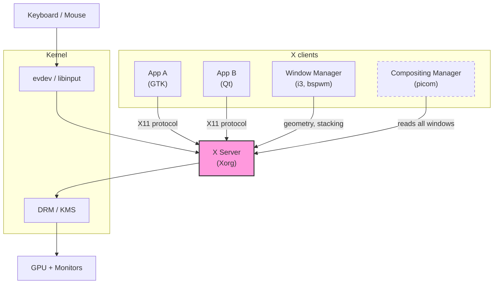
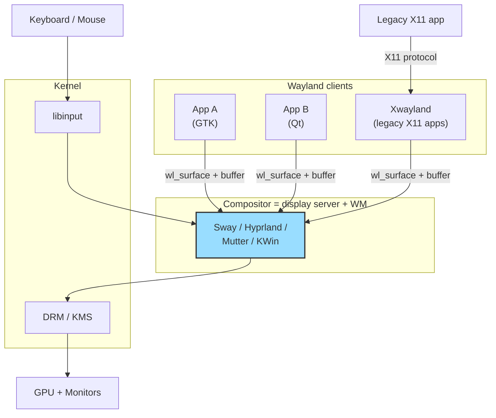
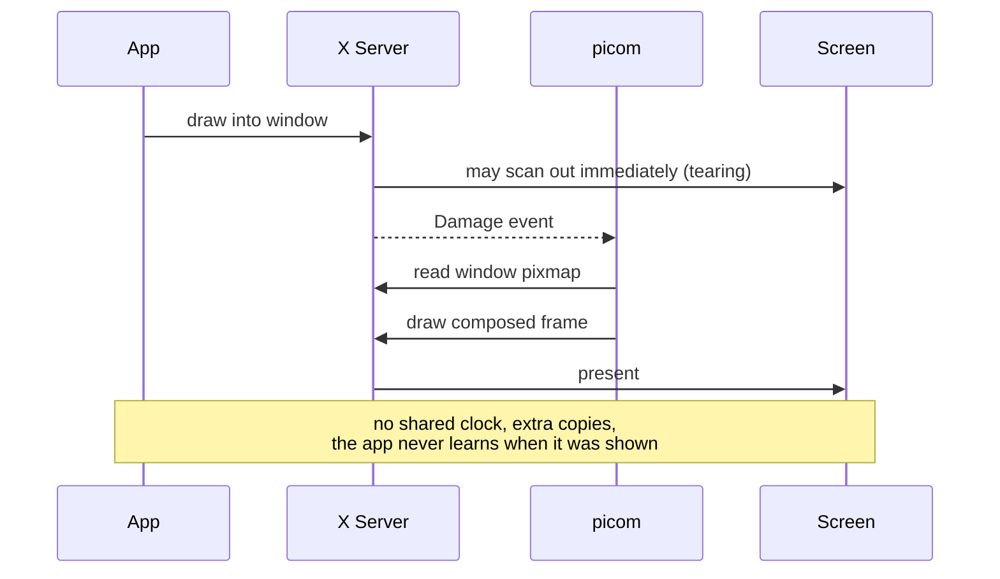
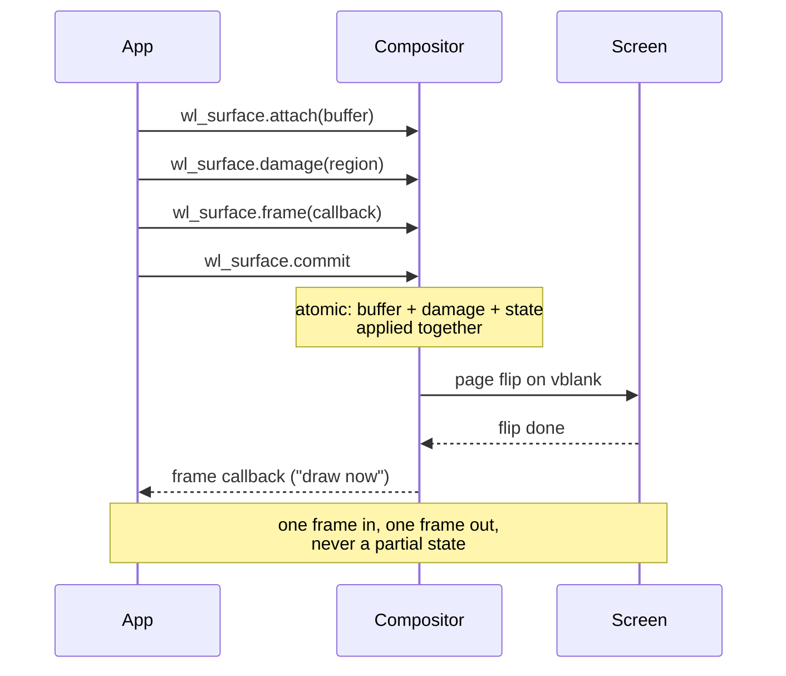
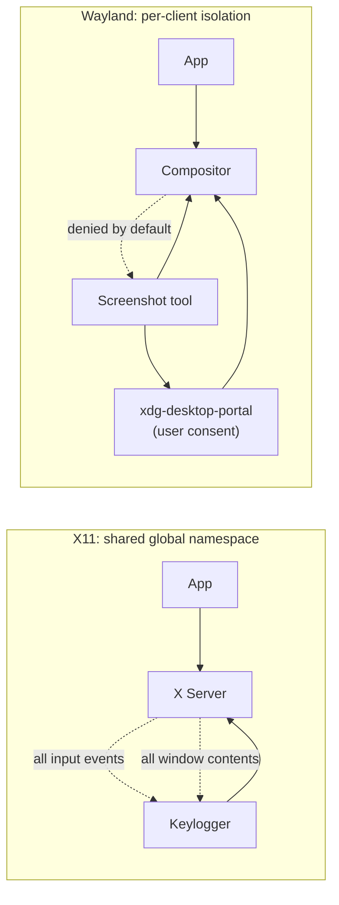
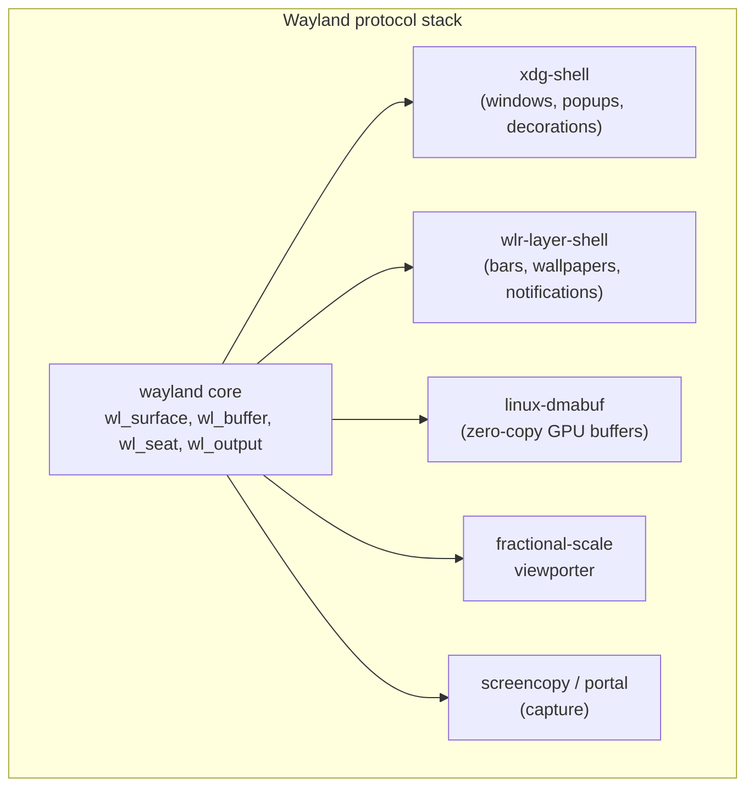
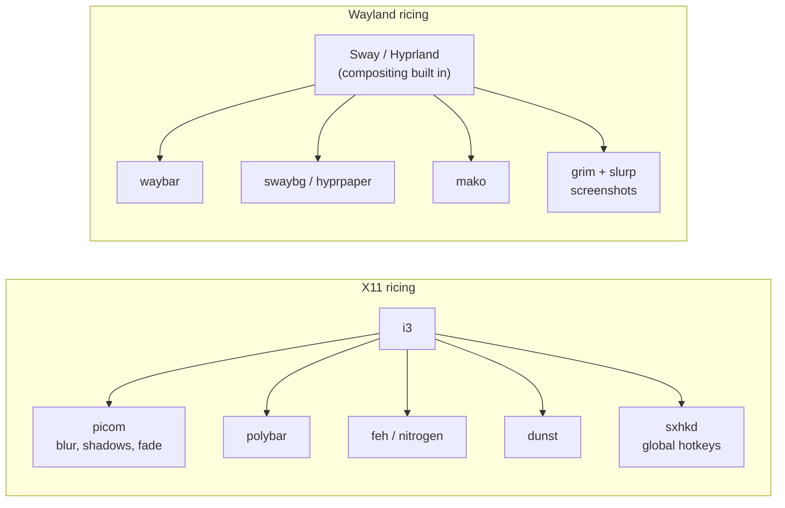
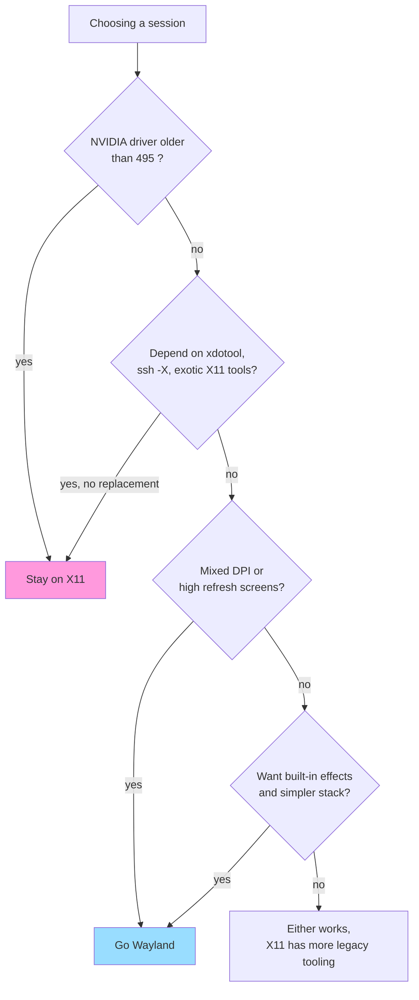

# X11 vs Wayland

Two display server protocols for Linux graphics. X11 dates from 1984 (X11 revision in 1987),
Wayland from 2008. Both answer the same question: how does an application put pixels on a
screen and receive input? They answer it very differently.

## TL;DR

| Topic                           | X11                                                                  | Wayland                                            |
| ------------------------------- | -------------------------------------------------------------------- | -------------------------------------------------- |
| Role of the server              | Central process doing drawing, input routing, compositing hand-off   | Protocol only; the compositor _is_ the server      |
| Composition                     | Optional, bolted on later (XComposite, 2004)                         | Mandatory, built into the core design              |
| Rendering                       | Historically server-side, today clients render and hand over buffers | Always client-side rendering, buffer sharing       |
| Frame correctness               | Tearing is the default, vsync is best effort                         | Every frame is atomic, no tearing by construction  |
| Client isolation                | None, any client can read any window and all input                   | Enforced, a client sees only its own surfaces      |
| Screen capture / global hotkeys | Trivially available to any client                                    | Requires an explicit portal or compositor protocol |
| Multi-DPI / per-monitor scaling | Single global scale, awkward workarounds                             | Per-output scale, native                           |
| Network transparency            | Built in (`ssh -X`)                                                  | Not built in (use waypipe, RDP, VNC)               |
| Ecosystem maturity              | Huge, 40 years of software                                           | Modern default on GNOME, KDE, Sway, Hyprland       |

## Architecture, X11

In X11 the X server owns the display. Clients talk to it over a socket, and a separate
process, the window manager, tells the server how to place windows. A compositing manager
is yet another client that gets the window contents and draws the final screen.

Note the three separate roles: server, window manager, compositor. Each is a process, each
round-trips through the server, and none of them share a single source of truth about what
the screen should look like right now.

## Architecture, Wayland

Wayland collapses those roles. The compositor is the display server, the window manager and
the compositing manager at once. It talks to the kernel directly and to clients over the
Wayland protocol.

Xwayland is the compatibility layer: a real X server that renders into a Wayland surface, so
40 years of X11 software keeps working.

## The frame lifecycle

This is where the practical difference shows up. In X11, a client can draw whenever it wants
and the server will happily show a half-updated window.

In Wayland, nothing reaches the screen until the client explicitly commits, and the
compositor tells the client when to draw the next frame.

"Every frame is perfect" is the Wayland design slogan, and it comes from this atomic commit
plus the frame callback acting as a natural vsync-paced clock.

## Security model

Under X11, any client can call `XGrabKeyboard` or read the root window, so a keylogger or a
screen recorder needs no privilege at all. Under Wayland, a client only sees its own
surfaces and only gets input when focused. Anything global (screenshots, screen sharing,
global shortcuts, remote control) goes through dedicated protocols
(`wlr-screencopy`, `ext-image-copy-capture`, `xdg-desktop-portal`) with user consent.

That is a genuine security win and also the source of most Wayland friction: tools written
against the X11 free-for-all have to be ported, and some behaviours (a global hotkey daemon,
an on-screen keyboard, an autoclicker) simply need compositor support that may not exist yet.

## Protocol structure

X11 is one monolithic core protocol plus roughly 25 extensions accumulated over decades
(XRender, XComposite, XRandR, XInput2, MIT-SHM, Xfixes, ...). Wayland is a tiny core plus
independently versioned extension protocols.

For ricing, `wlr-layer-shell` is the interesting one: it is the protocol that lets Waybar,
swaybg, mako, eww or Quickshell anchor panels and wallpapers to a screen edge. It is a
wlroots protocol, which is why bars written for Sway/Hyprland historically did not work on
GNOME (Mutter does not implement it; it now has `ext-layer-shell` discussions but support
still varies).

## What this means for a ricing setup

Practical trade-offs when riced:

- **Effects.** On X11 you add picom for blur, shadows and animations. On Wayland the
  compositor does it: Hyprland ships blur and animations natively, Sway keeps it minimal.
- **Config surface.** X11 setups spread across `.xinitrc`, WM config, picom, compositor,
  hotkey daemon. Wayland setups concentrate in the compositor config, plus a bar.
- **Mixed DPI.** A 4K laptop next to a 1080p monitor works properly on Wayland and is
  painful on X11 (`xrandr --scale` blur, single global `Xft.dpi`).
- **Screen sharing.** X11 just works everywhere. Wayland needs pipewire plus
  `xdg-desktop-portal-wlr` / `-gtk` / `-hyprland`, and older Electron apps may still need
  flags.
- **NVIDIA.** Historically the main Wayland blocker, largely resolved since driver 495
  (GBM support) and much better from 555 onwards (explicit sync).
- **Odd tools.** Anything doing global input injection or window poking (xdotool, autokey,
  some game overlays) needs a Wayland-native replacement (`wtype`, `ydotool`, compositor IPC
  like `swaymsg` / `hyprctl`).

## Migration decision

## Key takeaways

1. X11 is a _server_ that draws; Wayland is a _protocol_ and the compositor does everything.
2. X11's compositing and security were retrofitted; Wayland's are structural.
3. Wayland's atomic commit is why it does not tear and why per-monitor scaling works.
4. Wayland's isolation is a real security improvement and the reason legacy tools break.
5. Xwayland means the migration is incremental, not a cliff.

## References

- [Wayland architecture](https://wayland.freedesktop.org/architecture.html)
- [Wayland protocol specification](https://wayland.app/protocols/)
- [The Real Story Behind Wayland and X](https://www.youtube.com/watch?v=GWQh_DmDLKQ) (Daniel Stone, LCA 2013)
- [wlroots protocols](https://gitlab.freedesktop.org/wlroots/wlr-protocols)
- [Are we Wayland yet?](https://arewewaylandyet.com/)
