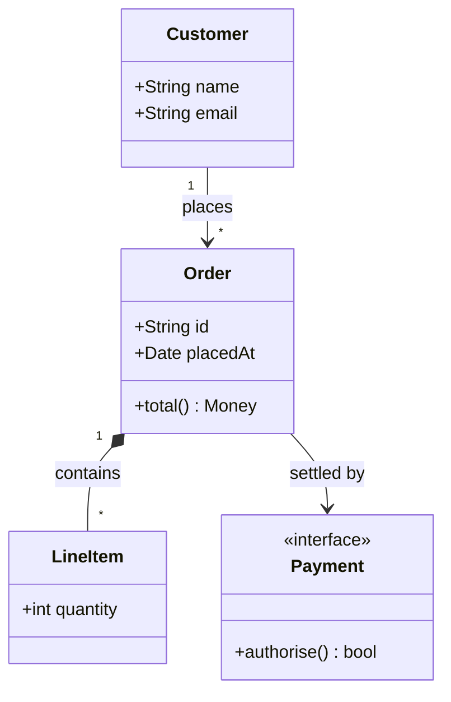
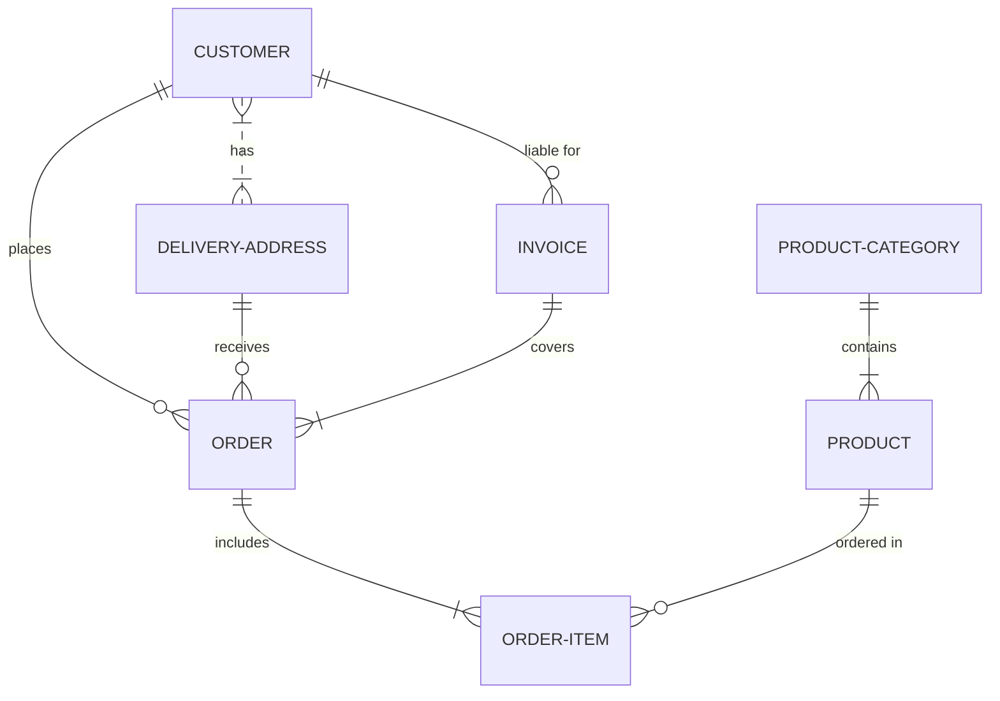
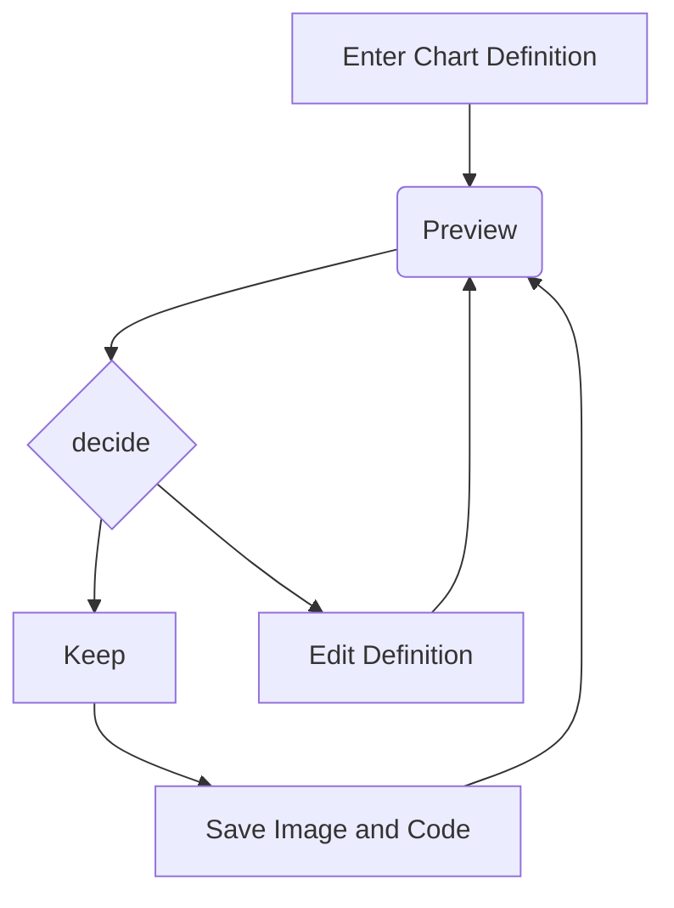

# "Ricing" Linux

    
        

            ou : Comment  une palette de couleurs  a changé ma manière  d'utiliser un ordinateur
        

    

Notes:
Speaker notes

## Intro

## Partie 1

```mermaid
classDiagram
  class Customer {
    +String name
    +String email
  }
  class Order {
    +String id
    +Date placedAt
    +total() Money
  }
  class LineItem {
    +int quantity
  }
  class Payment {
    <<interface>>
    +authorise() bool
  }
  Customer "1" --> "*" Order : places
  Order "1" *-- "*" LineItem : contains
  Order --> Payment : settled by
```

```mermaid
erDiagram
          CUSTOMER }|..|{ DELIVERY-ADDRESS : has
          CUSTOMER ||--o{ ORDER : places
          CUSTOMER ||--o{ INVOICE : "liable for"
          DELIVERY-ADDRESS ||--o{ ORDER : receives
          INVOICE ||--|{ ORDER : covers
          ORDER ||--|{ ORDER-ITEM : includes
          PRODUCT-CATEGORY ||--|{ PRODUCT : contains
          PRODUCT ||--o{ ORDER-ITEM : "ordered in"
```

```mermaid
graph TD
    A[Enter Chart Definition] --> B(Preview)
    B --> C{decide}
    C --> D[Keep]
    C --> E[Edit Definition]
    E --> B
    D --> F[Save Image and Code]
    F --> B
```
